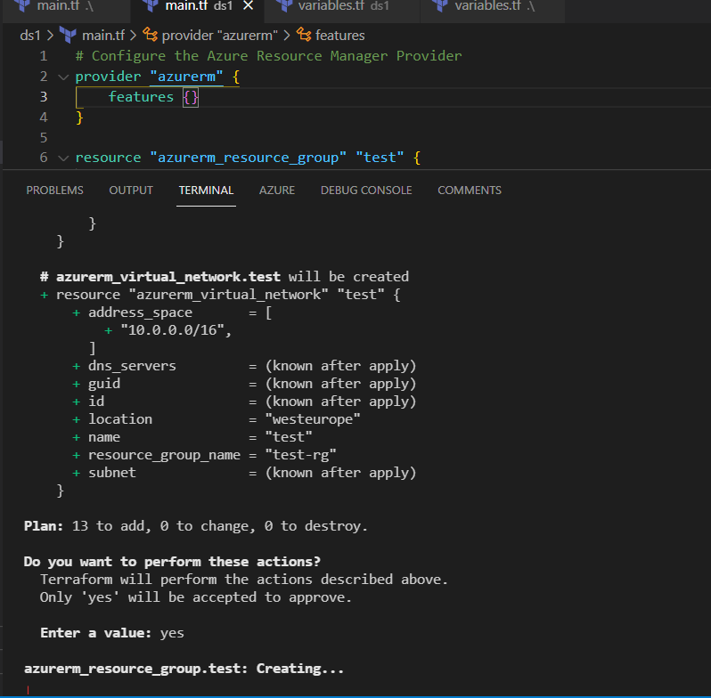

# Deployment of Azure Resources using Terraform

This repository contains a set of Terraform configuration files that can be used to deploy a set of Azure resources. The resources include:

Virtual Machines (azurerm_virtual_machine.test, azurerm_virtual_machine.test2, azurerm_virtual_machine.test3)

Network Interfaces (azurerm_network_interface.test, azurerm_network_interface.test2, azurerm_network_interface.test3)

Storage Container (azurerm_storage_container.test)

Subnets (azurerm_subnet.test, azurerm_subnet.test2, azurerm_subnet.test3)

Storage Account (azurem_storage_account.test)

Virtual Network (azurerm_virtual_network.test)

Resource Group (azurerm_resource_group.test)


.svg)

# Prerequisites

An Azure subscription
Terraform installed on your local machine. you can download it from [here](https://developer.hashicorp.com/terraform/downloads)

# Usage
1. Clone this repository to your local machine
2. Open the file "variables.tf" and update the values of the variables to match your environment.
3. Run the following command to initialize Terraform and download the necessary provider plugins:

```
terraform init
```
4. Run the following command to create the infrastructure in Azure:

```
terraform apply
```
This will create the resources in Azure and also output the necessary information needed to connect to the resources created.

5. When you're done with the resources, you can remove them by running the following command:

```
terraform destroy
```
# Note : 

Please make sure that you are authenticated with Azure subscription by running the 'az login' command before running any terraform command. This is necessary for Terraform to connect to your Azure subscription and create resources.

Please also make sure that you have enough permissions on your Azure subscription to create the resources. You can check your permissions by going to the Azure portal and looking at the roles assigned to your user or service principal.

Keep in mind that the resources created by this Terraform configuration may incur charges on your Azure subscription, it's good to keep an eye on your usage and costs, and also to delete or decommission the resources when they are no longer needed.

This is a basic example, but you can enhance this example by adding more resources and also by using the [Terraform remote state](https://developer.hashicorp.com/terraform/language/state/remote) features. This allows you to collaborate with others and also makes it easier to manage your state files.

You can also use [Terraform workspaces](https://developer.hashicorp.com/terraform/language/state/workspaces) to manage different environments such as development, staging, and production. This allows you to maintain separate state files for each environment and switch between them easily.

Finally, always make sure to version control your Terraform configuration files and maintain a history of changes to your infrastructure. This will help you to track what changes has been made and also to rollback if needed.





***

